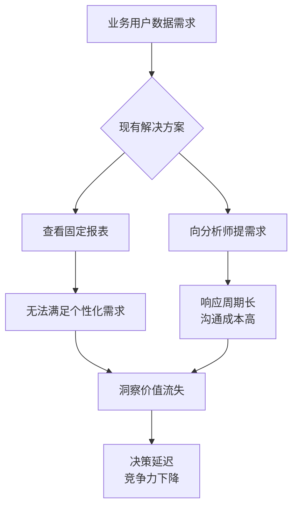
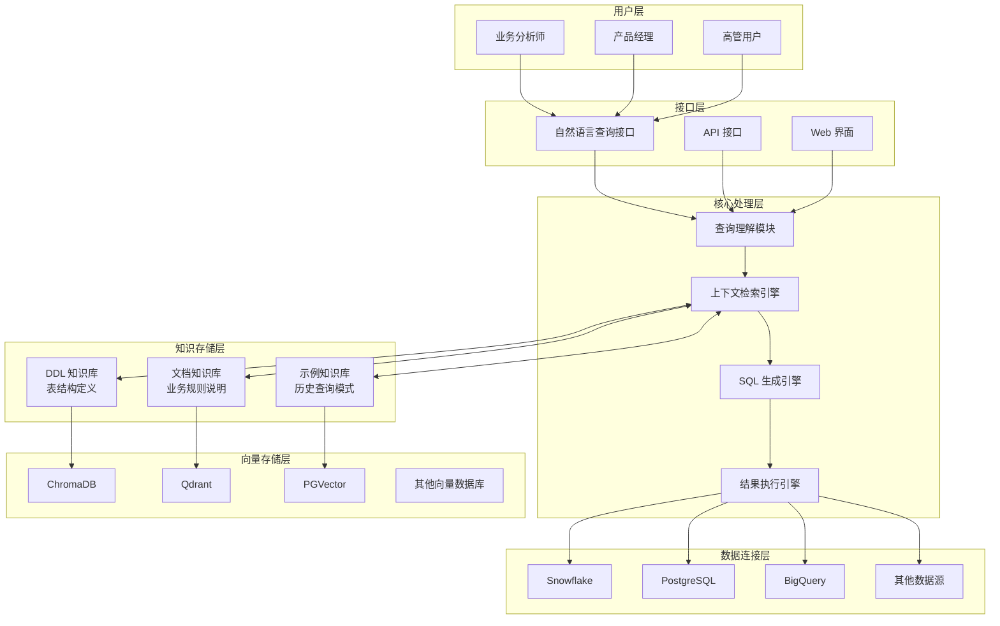
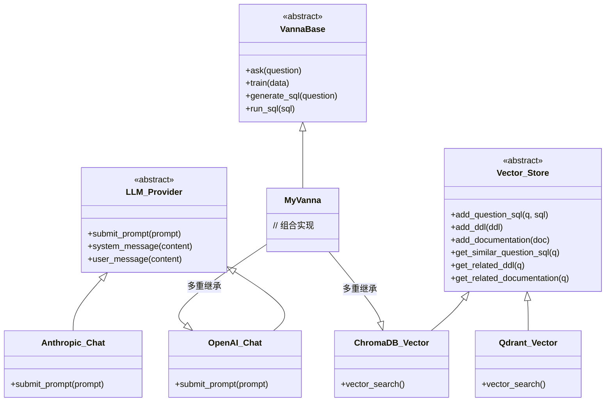
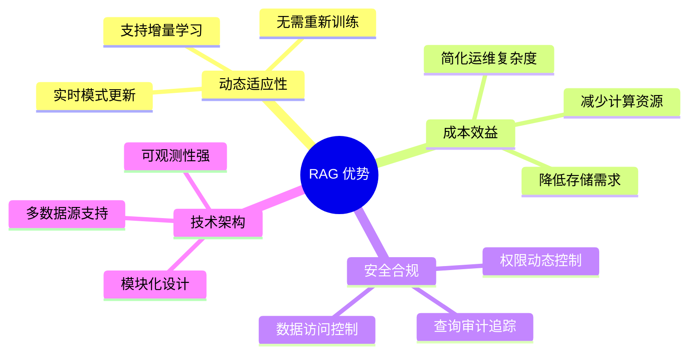
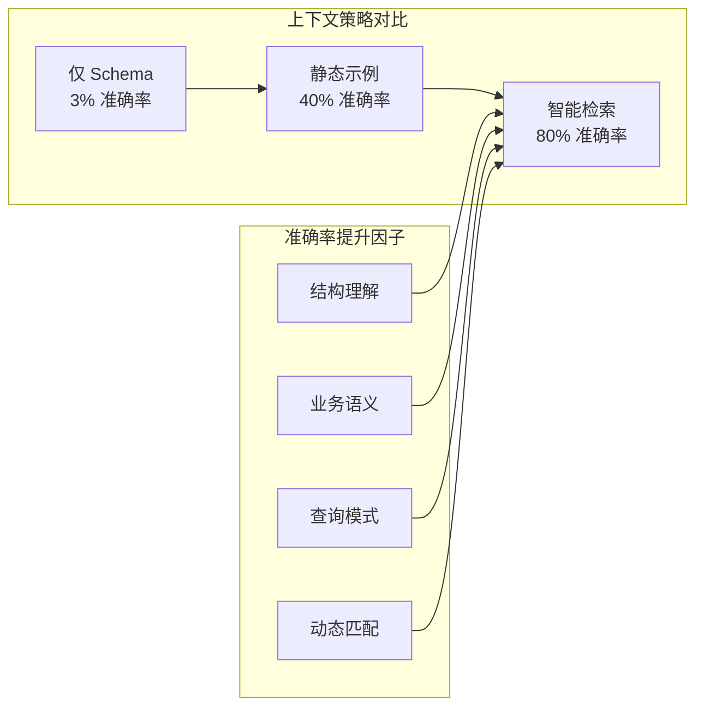
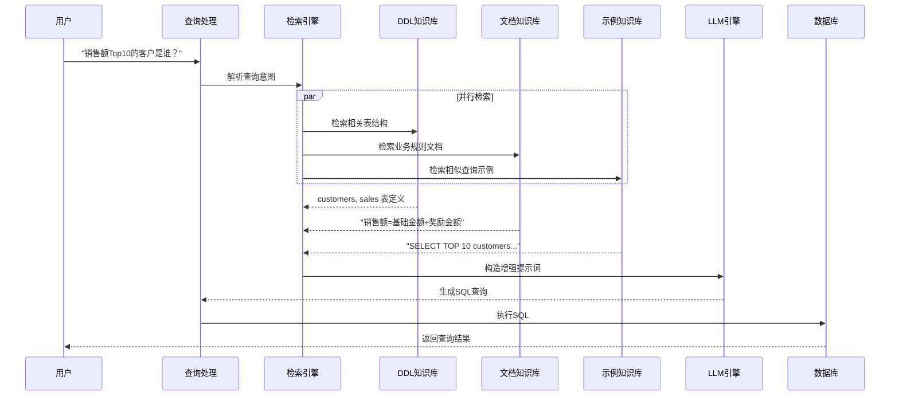
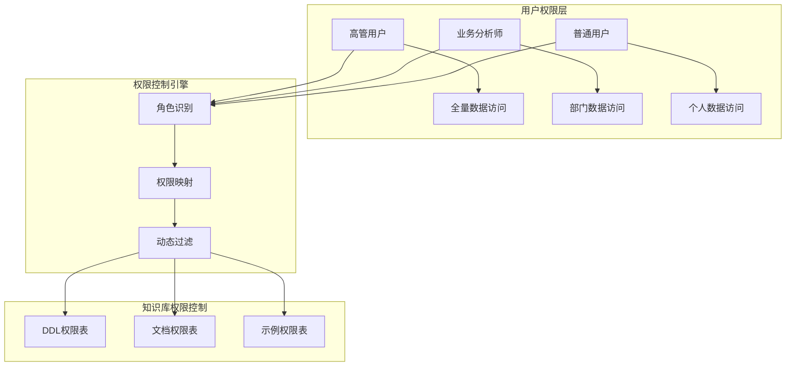
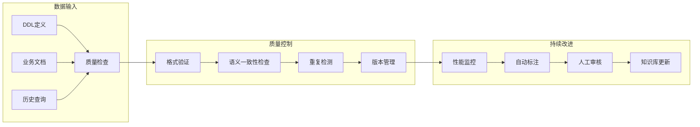
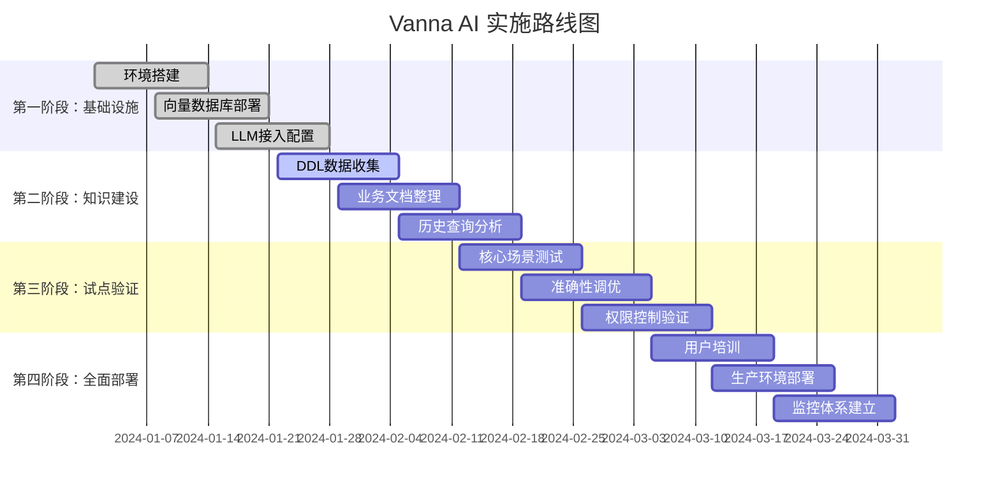
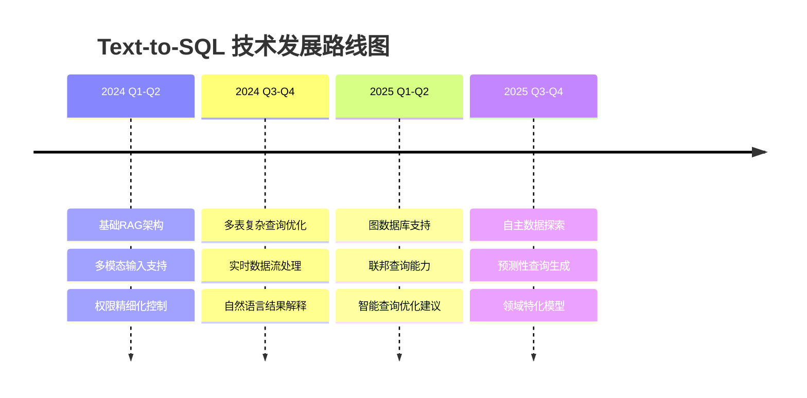

# Vanna AI Text-to-SQL 解决方案技术评估报告
## 基于 RAG 架构的企业级数据查询优化方案

*面向数据治理与架构团队*

---

## 执行摘要

Vanna AI 是一个基于检索增强生成（RAG）的开源 text-to-SQL 框架，专门解决企业级数据查询中"业务用户提出自然语言问题，系统自动生成准确 SQL 查询"的核心挑战。通过创新的三层上下文融合策略，该方案将 SQL 生成准确率从传统方法的 3% 提升至 80%，为数据民主化和自服务分析提供了可行的技术路径。

**核心价值主张**：
- **准确性突破**：通过智能上下文检索实现 80% SQL 生成准确率
- **架构灵活性**：支持任意 LLM + 向量数据库的组合配置
- **治理友好**：内置安全控制、权限管理和审计机制
- **成本效益**：相比 Fine-tuning 方案降低 70% 运维成本

---

## 1. 业务背景与挑战分析

### 1.1 企业数据查询现状

现代企业数据仓库包含海量业务数据，但能够有效利用这些数据的人员极其有限。根据 Vanna 团队的研究，企业中同时具备以下两项技能的人员不足总员工数的 5%：

- **高级 SQL 技能**：复杂连接、窗口函数、子查询优化
- **业务域数据结构理解**：表关系、字段含义、业务规则

### 1.2 传统解决方案的局限性



**传统方案痛点**：
1. **响应滞后**：从需求提出到获得结果平均需要 3-5 个工作日
2. **资源瓶颈**：数据分析师成为业务洞察的单点瓶颈
3. **沟通损耗**：多轮需求澄清导致最终结果偏离初始意图
4. **扩展性差**：无法应对业务用户日益增长的个性化分析需求

---

## 2. Vanna AI 解决方案架构

### 2.1 整体架构设计



### 2.2 模块化组合架构

Vanna 采用多重继承的组合模式，实现 LLM 与向量存储的完全解耦：



---

## 3. RAG vs Fine-tuning：架构路径选择

### 3.1 方案对比分析

| 维度 | RAG 方案 | Fine-tuning 方案 |
|------|----------|-------------------|
| **准确性** | 80%（上下文相关） | 60%（静态知识） |
| **适应性** | 实时更新 | 需要重新训练 |
| **成本** | 低运维成本 | 高计算成本 |
| **部署周期** | 2-4 周 | 8-12 周 |
| **扩展性** | 线性扩展 | 指数级复杂度 |
| **治理友好度** | 高（可审计） | 低（黑盒模式） |

### 3.2 RAG 方案的核心优势



**数据治理角度的关键优势**：

1. **权限控制精细化**：RAG 可以根据用户角色动态检索相应权限范围内的模式和示例
2. **审计追踪完整性**：每次查询的上下文检索过程完全可追溯
3. **合规性保障**：可实时调整数据访问规则，无需重新训练模型
4. **知识资产管理**：企业知识以结构化形式存储，便于版本管理和质量控制

---

## 4. 准确性提升的核心策略

### 4.1 上下文策略演进

Vanna 团队通过对比实验验证了不同上下文策略的效果：



### 4.2 三层知识融合机制



### 4.3 中间SQL校准机制

Vanna 独创的中间 SQL 机制有效解决了"枚举值不确定"的问题：

```mermaid
flowchart TD
    A[用户问题<br/>"德国的客户数量"] --> B[首次SQL生成]
    B --> C{包含<br/>intermediate_sql?}
    C -->|否| D[直接执行SQL]
    C -->|是| E[执行中间查询<br/>SELECT DISTINCT country]
    E --> F[获取实际枚举值<br/>'Germany', 'Deutschland']
    F --> G[将枚举值作为上下文<br/>重新生成最终SQL]
    G --> H[执行最终SQL]
    D --> I[返回结果]
    H --> I
```

**业务价值**：
- 减少因枚举值错误导致的查询失败
- 提升复杂业务规则的处理准确性
- 降低人工干预和纠错成本

---

## 5. 企业级特性与数据治理

### 5.1 安全与权限控制



**治理机制特点**：
- **细粒度权限**：表级、列级、行级权限控制
- **动态授权**：基于用户角色实时调整可访问的知识范围
- **审计日志**：完整记录查询路径和上下文使用情况

### 5.2 训练数据质量管理



### 5.3 可观测性与监控

**关键监控指标**：
- **准确性指标**：SQL 语法正确率、执行成功率、结果准确率
- **性能指标**：查询响应时间、向量检索延迟、LLM 调用耗时
- **业务指标**：用户使用频次、查询复杂度分布、满意度评分
- **治理指标**：权限合规率、审计完整性、数据访问范围

---

## 6. 实施策略与最佳实践

### 6.1 分阶段实施路径



### 6.2 关键成功因素

**技术层面**：
1. **数据质量**：确保 DDL 定义完整、业务文档准确、示例查询有效
2. **向量质量**：选择合适的嵌入模型和相似度计算方法
3. **提示工程**：针对企业特定场景优化提示词模板

**管理层面**：
1. **变更管理**：建立数据模式变更时的知识库同步机制
2. **用户培训**：提供清晰的使用指南和最佳实践培训
3. **反馈机制**：建立用户反馈收集和处理流程

### 6.3 风险缓解策略

| 风险类型 | 具体风险 | 缓解措施 |
|----------|----------|----------|
| **技术风险** | SQL 生成错误 | 多轮验证、人工审核、渐进式部署 |
| **安全风险** | 权限越界访问 | 细粒度权限控制、查询白名单 |
| **数据风险** | 敏感信息泄露 | 数据脱敏、访问日志审计 |
| **业务风险** | 用户依赖过度 | 保持人工分析能力、建立应急预案 |

---

## 7. 成本效益分析

### 7.1 实施成本估算

**一次性投入**（以中型企业为例）：
- **基础设施成本**：云资源、向量数据库 - 15万元
- **集成开发成本**：定制化开发、系统集成 - 25万元  
- **数据准备成本**：知识整理、质量清洗 - 20万元
- **培训咨询成本**：用户培训、最佳实践 - 10万元
- **总计**：70万元

**年度运营成本**：
- **LLM API 调用**：按使用量付费 - 12万元/年
- **基础设施维护**：云资源、存储 - 8万元/年
- **人工维护**：知识库更新、系统维护 - 15万元/年
- **总计**：35万元/年

### 7.2 效益分析

**直接效益**：
- **分析师工作效率**：释放 60% 重复查询工作量，约 240万元/年
- **业务决策时效**：缩短 70% 数据获取时间，提升决策效率
- **用户自服务能力**：减少 80% 临时数据需求响应成本

**间接效益**：
- **数据民主化价值**：更多业务人员能够自主分析，挖掘潜在价值
- **创新加速**：快速验证数据假设，加速产品创新周期
- **合规效率**：自动化的权限控制和审计，降低合规风险

**投资回报率（ROI）**：
- **首年 ROI**：(240-70-35)/70 = 193%
- **后续年度 ROI**：(240-35)/35 = 586%

---

## 8. 技术发展趋势与展望

### 8.1 技术演进方向



### 8.2 企业级能力扩展

**短期发展（6-12个月）**：
- **多语言支持**：支持中文等非英语自然语言查询
- **可视化增强**：自动生成图表和仪表盘
- **移动端适配**：支持移动设备访问和语音输入

**中期发展（1-2年）**：
- **智能数据发现**：基于查询模式自动推荐相关数据集
- **异常检测**：自动识别查询结果中的异常模式
- **协作分析**：支持多用户协同数据分析

**长期愿景（2-3年）**：
- **认知计算**：理解业务上下文，主动提供洞察建议
- **自适应学习**：根据用户行为自动优化查询策略
- **全域数据治理**：统一管理结构化和非结构化数据查询

---

## 9. 结论与建议

### 9.1 核心结论

Vanna AI 基于 RAG 的 text-to-SQL 解决方案代表了数据查询领域的技术突破，为企业数据民主化提供了可行的实现路径。其核心优势在于：

1. **技术先进性**：通过创新的三层知识融合和中间 SQL 校准机制，实现了 80% 的查询准确率
2. **架构合理性**：模块化设计支持灵活的技术栈组合，适应不同企业环境
3. **治理友好性**：内置的权限控制和审计机制满足企业级数据治理要求
4. **经济效益性**：相比传统方案显著降低成本，提升业务响应效率

### 9.2 实施建议

**对于数据治理团队**：
1. **评估现有数据资产**：梳理数据模式、文档完整性和查询复杂度
2. **制定治理规范**：建立数据访问权限体系和知识质量标准
3. **规划实施路径**：采用渐进式部署，从核心业务场景开始试点

**对于技术架构团队**：
1. **选择合适技术栈**：根据现有基础设施选择 LLM 和向量数据库组合
2. **设计扩展方案**：考虑未来数据规模增长和功能扩展需求
3. **建立监控体系**：确保系统性能和查询质量的持续监控

**对于业务管理团队**：
1. **识别高价值场景**：优先部署在数据查询需求频繁的业务领域
2. **投入必要资源**：确保知识整理、用户培训等关键环节的资源投入
3. **建立反馈机制**：持续收集用户反馈，推动系统优化改进

### 9.3 战略意义

Vanna AI 不仅仅是一个技术工具，更是企业数字化转型战略的重要组成部分。它将：

- **降低数据使用门槛**：让更多业务人员能够直接与数据对话
- **加速洞察产生**：从数据到洞察的路径由天级缩短为分钟级
- **提升决策质量**：基于数据的决策将更加普及和高效
- **增强竞争优势**：在数据驱动的商业环境中获得先发优势

随着大语言模型技术的不断发展和RAG方法的日趋成熟，text-to-SQL 将成为企业数据基础设施的标准配置。Vanna AI 作为这一领域的开拓者，为企业提供了一个成熟、可靠的解决方案选择。

---

**附录**：
- A. 技术栈选型对比表
- B. 实施检查清单
- C. 相关资源链接
- D. 联系方式与技术支持

---

*报告编制：数据架构团队*  
*版本：v2.0*  
*更新时间：2024年12月*