# Vanna技术调研报告

## 目录
- [项目概述](#项目概述)
- [整体架构设计](#1-整体架构设计)
- [核心基类实现](#2-核心基类vannabase实现)
- [LLM集成模块](#3-llm集成模块实现)
- [向量数据库RAG实现](#4-向量数据库rag实现)
- [训练机制和数据流](#5-training训练机制和数据流)
- [查询流程和检索过程](#6-ask查询流程和rag检索过程)
- [技术创新点](#7-技术创新点)
- [技术实现框架总结](#8-技术实现框架总结)

---

## 项目概述

**Vanna** 是一个基于RAG（检索增强生成）技术的开源Python框架，专门用于自然语言到SQL的转换。该项目采用MIT许可证，通过结合向量数据库和大语言模型来显著提高text-to-SQL的准确性和实用性。

### 核心特性
- 🤖 支持30+种大语言模型（OpenAI、Anthropic、Google等）
- 🗄️ 集成多种向量数据库（ChromaDB、Pinecone、Weaviate等）
- 🧠 基于RAG的智能上下文检索
- 📊 自动可视化生成
- 🔄 增量学习和自我优化

---

## 1. 整体架构设计

### 1.1 核心架构模式

Vanna采用**多重继承的模块化架构**，实现了LLM和向量数据库的完全解耦：

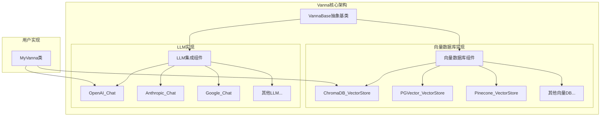

### 1.2 实现示例

```python
from vanna.openai.openai_chat import OpenAI_Chat
from vanna.chromadb.chromadb_vector import ChromaDB_VectorStore

class MyVanna(ChromaDB_VectorStore, OpenAI_Chat):
    def __init__(self, config=None):
        ChromaDB_VectorStore.__init__(self, config=config)
        OpenAI_Chat.__init__(self, config=config)
```

### 1.3 项目目录结构

```
vanna/
├── src/vanna/
│   ├── base/                    # 核心抽象基类
│   ├── openai/                 # OpenAI集成 (GPT-3.5/4)
│   ├── anthropic/              # Anthropic集成 (Claude)
│   ├── google/                 # Google集成 (Gemini)
│   ├── chromadb/               # ChromaDB向量存储
│   ├── pgvector/               # PostgreSQL向量扩展
│   ├── pinecone/               # Pinecone向量数据库
│   ├── weaviate/               # Weaviate向量数据库
│   └── [30+ 其他集成目录]
├── training_data/              # 示例训练数据集
│   ├── sample-salaries/        # 薪资数据示例
│   ├── sample-fraud/           # 欺诈检测示例
│   └── tpc-h/                  # TPC-H基准测试
└── tests/                      # 单元测试
```

---

## 2. 核心基类VannaBase实现

### 2.1 设计理念

`VannaBase` (`src/vanna/base/base.py:72`) 是整个框架的核心抽象类，定义了标准化的方法命名规范和接口：

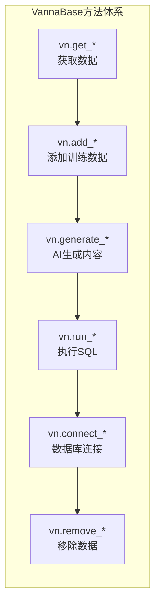

### 2.2 关键抽象方法

```python
class VannaBase(ABC):
    # 向量嵌入生成
    @abstractmethod
    def generate_embedding(self, data: str) -> List[float]:
        pass
    
    # RAG检索核心方法
    @abstractmethod
    def get_similar_question_sql(self, question: str) -> list:
        pass
    
    @abstractmethod
    def get_related_ddl(self, question: str) -> list:
        pass
    
    @abstractmethod
    def get_related_documentation(self, question: str) -> list:
        pass
    
    # LLM交互
    @abstractmethod
    def submit_prompt(self, prompt) -> str:
        pass
```

### 2.3 核心业务流程

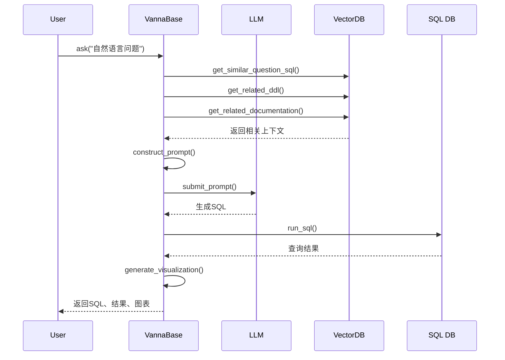

---

## 3. LLM集成模块实现

### 3.1 OpenAI集成 (`src/vanna/openai/openai_chat.py`)

```python
class OpenAI_Chat(VannaBase):
    def __init__(self, client=None, config=None):
        self.temperature = 0.7  # 可配置创造性
        self.client = OpenAI(api_key=config.get("api_key"))
    
    def submit_prompt(self, prompt, **kwargs) -> str:
        # 智能模型选择：根据token数量选择合适模型
        if num_tokens > 3500:
            model = "gpt-3.5-turbo-16k"
        else:
            model = "gpt-3.5-turbo"
            
        response = self.client.chat.completions.create(
            model=model,
            messages=prompt,
            temperature=self.temperature
        )
        return response.choices[0].message.content
```

### 3.2 Anthropic集成 (`src/vanna/anthropic/anthropic_chat.py`)

```python
class Anthropic_Chat(VannaBase):
    def submit_prompt(self, prompt, **kwargs) -> str:
        # Claude特殊处理：分离system message
        system_message = ''
        no_system_prompt = []
        for prompt_message in prompt:
            if prompt_message['role'] == 'system':
                system_message = prompt_message['content']
            else:
                no_system_prompt.append(prompt_message)
                
        response = self.client.messages.create(
            model=self.config["model"],
            messages=no_system_prompt,
            system=system_message,
            max_tokens=self.max_tokens
        )
        return response.content[0].text
```

### 3.3 LLM架构图

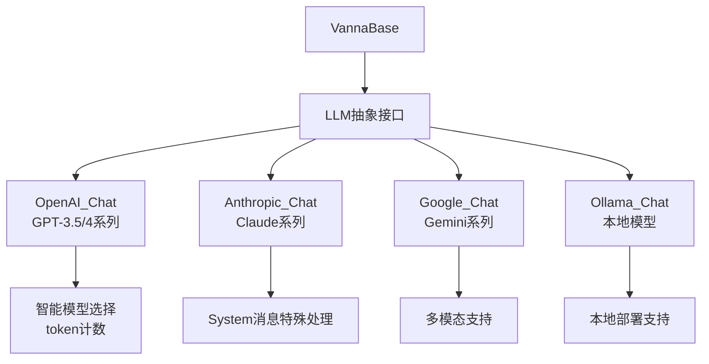

---

## 4. 向量数据库RAG实现

### 4.1 RAG三维检索架构

Vanna实现了独特的**三维RAG检索系统**：

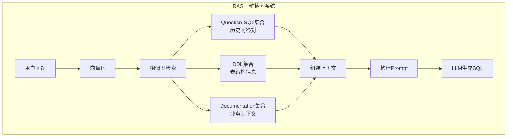

### 4.2 ChromaDB实现详解 (`src/vanna/chromadb/chromadb_vector.py`)

```python
class ChromaDB_VectorStore(VannaBase):
    def __init__(self, config=None):
        # 三个独立集合
        self.documentation_collection = self.chroma_client.get_or_create_collection(
            name="documentation", embedding_function=self.embedding_function)
        self.ddl_collection = self.chroma_client.get_or_create_collection(
            name="ddl", embedding_function=self.embedding_function)
        self.sql_collection = self.chroma_client.get_or_create_collection(
            name="sql", embedding_function=self.embedding_function)
    
    def add_question_sql(self, question: str, sql: str) -> str:
        # 确定性ID生成，避免重复
        question_sql_json = json.dumps({
            "question": question, "sql": sql
        }, ensure_ascii=False)
        id = deterministic_uuid(question_sql_json) + "-sql"
        
        self.sql_collection.add(
            documents=question_sql_json,
            embeddings=self.generate_embedding(question_sql_json),
            ids=id
        )
        return id
```

### 4.3 向量数据库生态支持

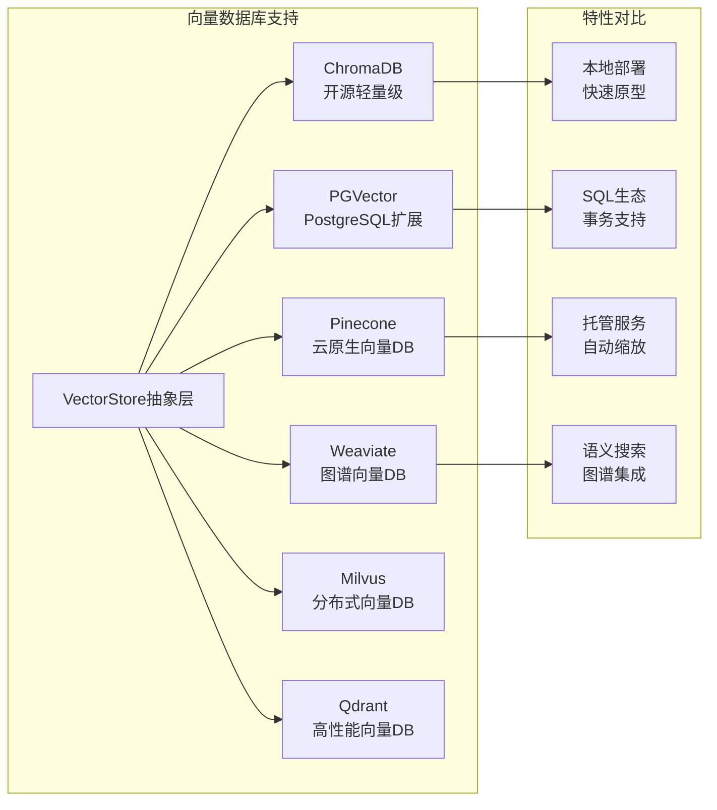

### 4.4 PGVector实现 (`src/vanna/pgvector/pgvector.py`)

```python
class PG_VectorStore(VannaBase):
    def __init__(self, config=None):
        # 使用LangChain的PGVector封装
        self.sql_collection = PGVector(
            embeddings=self.embedding_function,
            collection_name="sql",
            connection=self.connection_string
        )
        
        # 默认使用HuggingFace embeddings
        if "embedding_function" not in config:
            from langchain_huggingface import HuggingFaceEmbeddings
            self.embedding_function = HuggingFaceEmbeddings(
                model_name="all-MiniLM-L6-v2"
            )
```

---

## 5. Training训练机制和数据流

### 5.1 训练数据类型和流程

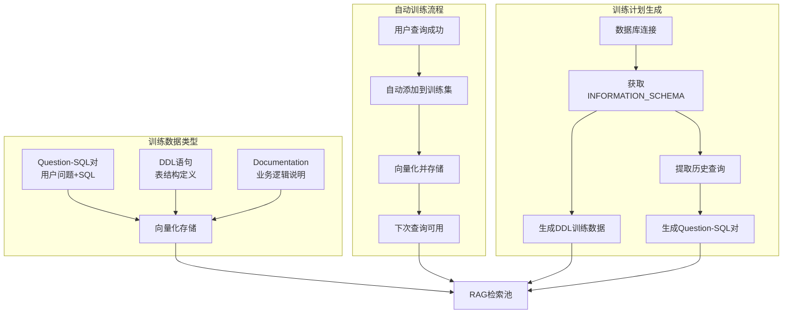

### 5.2 训练方法实现 (`src/vanna/base/base.py:1796`)

```python
def train(self, question=None, sql=None, ddl=None, documentation=None, plan=None):
    """统一的训练接口"""
    
    if documentation:
        print("Adding documentation....")
        return self.add_documentation(documentation)
    
    if sql:
        if question is None:
            # 自动从SQL生成问题
            question = self.generate_question(sql)
            print(f"Question generated with sql: {question}")
        return self.add_question_sql(question=question, sql=sql)
    
    if ddl:
        print(f"Adding ddl: {ddl}")
        return self.add_ddl(ddl)
    
    if plan:
        # 批量训练计划执行
        for item in plan._plan:
            if item.item_type == TrainingPlanItem.ITEM_TYPE_DDL:
                self.add_ddl(item.item_value)
            elif item.item_type == TrainingPlanItem.ITEM_TYPE_IS:
                self.add_documentation(item.item_value)
            elif item.item_type == TrainingPlanItem.ITEM_TYPE_SQL:
                self.add_question_sql(question=item.item_name, sql=item.item_value)
```

### 5.3 自动训练计划生成

```python
def get_training_plan_snowflake(self, filter_databases=None, use_historical_queries=True):
    """Snowflake专用训练计划"""
    plan = TrainingPlan([])
    
    if use_historical_queries:
        # 提取历史查询作为训练数据
        df_history = self.run_sql("""
            SELECT * FROM table(information_schema.query_history(result_limit => 5000)) 
            ORDER BY start_time
        """)
        
        for query in df_history["QUERY_TEXT"].unique().tolist():
            plan._plan.append(TrainingPlanItem(
                item_type=TrainingPlanItem.ITEM_TYPE_SQL,
                item_name=self.generate_question(query),
                item_value=query
            ))
    
    return plan
```

### 5.4 训练数据示例结构

```json
// training_data/sample-salaries/questions.json
[
    {
        "question": "What is the engineer to product manager ratio in Facebook, Amazon, Google?",
        "answer": "SELECT company, count(case when title like '%Engineer%' then 1 else null end) as engineer_count, count(case when title like '%Product Manager%' then 1 else null end) as product_manager_count FROM salaries_data WHERE company in ('Facebook', 'Amazon', 'Google') GROUP BY company"
    }
]
```

---

## 6. Ask查询流程和RAG检索过程

### 6.1 完整查询流程架构

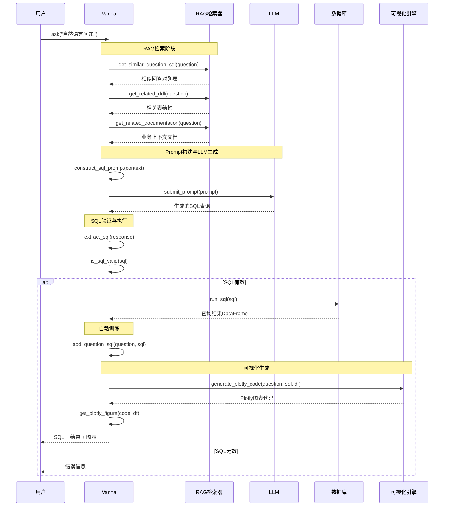

### 6.2 核心generate_sql方法解析 (`src/vanna/base/base.py:93`)

```python
def generate_sql(self, question: str, allow_llm_to_see_data=False) -> str:
    """RAG增强的SQL生成"""
    
    # 1. RAG三维检索
    question_sql_list = self.get_similar_question_sql(question)
    ddl_list = self.get_related_ddl(question) 
    doc_list = self.get_related_documentation(question)
    
    # 2. 动态Prompt构建
    prompt = self.get_sql_prompt(
        initial_prompt=self.config.get("initial_prompt"),
        question=question,
        question_sql_list=question_sql_list,
        ddl_list=ddl_list,
        doc_list=doc_list
    )
    
    # 3. LLM生成SQL
    llm_response = self.submit_prompt(prompt)
    
    # 4. 智能中间查询处理
    if 'intermediate_sql' in llm_response and allow_llm_to_see_data:
        # 执行中间SQL探索数据
        intermediate_sql = self.extract_sql(llm_response)
        df = self.run_sql(intermediate_sql)
        
        # 重新构建包含数据上下文的Prompt
        enhanced_doc_list = doc_list + [
            f"Intermediate SQL query results: \n{df.to_markdown()}"
        ]
        prompt = self.get_sql_prompt(question=question, doc_list=enhanced_doc_list)
        llm_response = self.submit_prompt(prompt)
    
    return self.extract_sql(llm_response)
```

### 6.3 智能Prompt工程

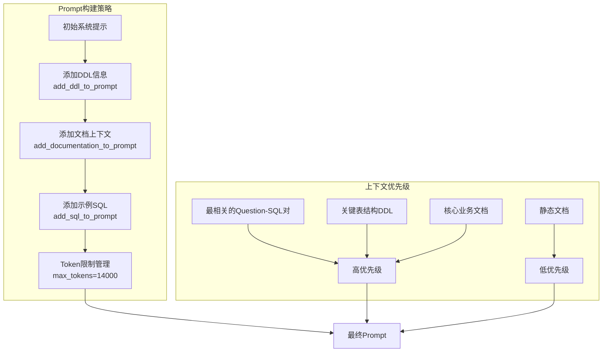

### 6.4 自动训练反馈循环

```python
# ask方法中的自动训练逻辑
def ask(self, question: str, auto_train=True):
    sql = self.generate_sql(question)
    df = self.run_sql(sql)
    
    # 成功执行的查询自动加入训练集
    if len(df) > 0 and auto_train:
        self.add_question_sql(question=question, sql=sql)
        
    return sql, df, visualization
```

---

## 7. 技术创新点

### 7.1 核心创新架构

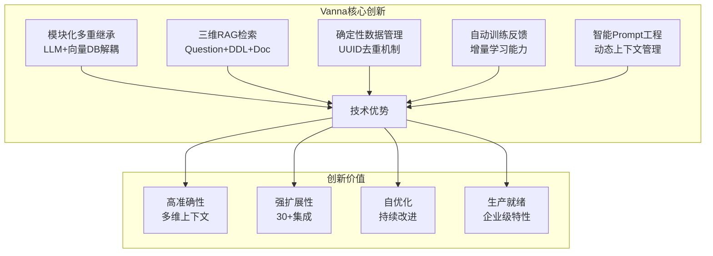

### 7.2 RAG技术创新详解

#### 7.2.1 三维检索系统
- **Question-SQL维度**：通过向量相似度找到历史相似查询
- **DDL维度**：提供准确的表结构和字段信息
- **Documentation维度**：包含业务逻辑和上下文说明

#### 7.2.2 智能上下文管理
```python
def add_ddl_to_prompt(self, initial_prompt: str, ddl_list: list, max_tokens: int = 14000):
    """动态DDL添加策略"""
    if len(ddl_list) > 0:
        initial_prompt += "\n===Tables \n"
        
        for ddl in ddl_list:
            # Token计数和优先级管理
            if (self.str_to_approx_token_count(initial_prompt) + 
                self.str_to_approx_token_count(ddl) < max_tokens):
                initial_prompt += f"{ddl}\n\n"
    
    return initial_prompt
```

### 7.3 工程化创新

#### 7.3.1 确定性UUID生成
```python
def deterministic_uuid(data: str) -> str:
    """确保相同数据生成相同ID，避免重复存储"""
    return str(uuid.uuid5(uuid.NAMESPACE_DNS, data))
```

#### 7.3.2 自适应模型选择
```python
def submit_prompt(self, prompt):
    num_tokens = sum(len(msg["content"])/4 for msg in prompt)
    
    # 根据token数量智能选择模型
    if num_tokens > 3500:
        model = "gpt-3.5-turbo-16k"
    else:
        model = "gpt-3.5-turbo"
```

### 7.4 创新技术对比

| 传统Text-to-SQL | Vanna框架 |
|----------------|----------|
| 单一模型训练 | 模块化组合架构 |
| 静态提示词 | 动态RAG检索 |
| 单次生成 | 增量学习优化 |
| 有限上下文 | 三维上下文检索 |
| 黑盒系统 | 透明可控流程 |

---

## 8. 技术实现框架总结

### 8.1 架构优势总览

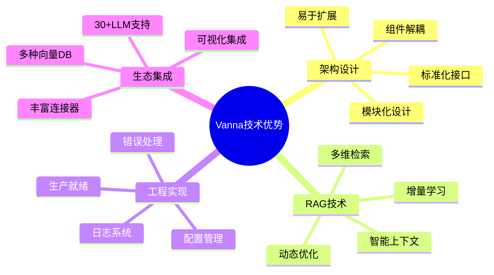

### 8.2 核心技术栈

#### 8.2.1 LLM生态支持
- **OpenAI系列**: GPT-3.5-turbo, GPT-4, text-embedding-ada-002
- **Anthropic系列**: Claude-3 Haiku/Sonnet/Opus
- **Google系列**: Gemini Pro/Ultra, PaLM
- **开源模型**: Ollama本地部署支持
- **其他商用**: Azure OpenAI, AWS Bedrock等

#### 8.2.2 向量数据库生态
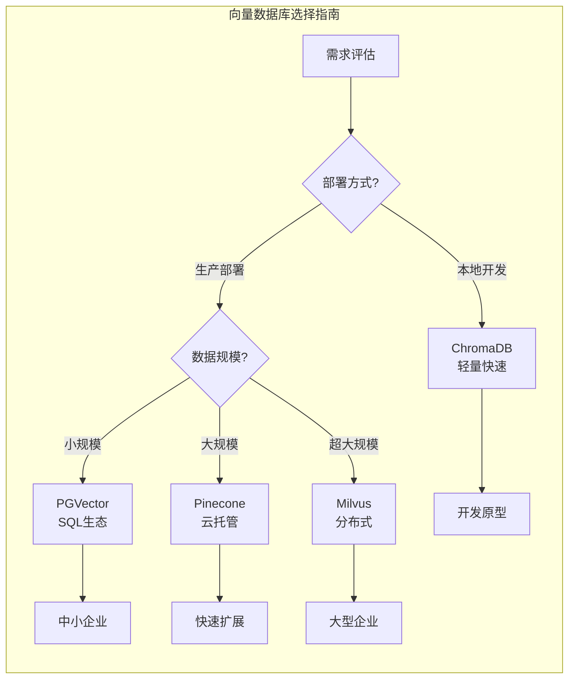

### 8.3 适用场景分析

#### 8.3.1 企业应用场景
- **商业智能平台**: 自然语言查询接口
- **数据分析工具**: 降低SQL学习门槛
- **客服系统集成**: 自动数据查询回答
- **报表系统**: 动态报表生成

#### 8.3.2 技术场景
- **数据科学工作流**: 快速数据探索
- **DevOps监控**: 自然语言日志查询
- **教育培训**: SQL学习辅助工具

### 8.4 性能和扩展性

#### 8.4.1 性能优化策略
```python
# 缓存机制
@lru_cache(maxsize=1000)
def get_similar_question_sql(self, question: str):
    """缓存相似问题检索结果"""
    pass

# 批量处理
def train_batch(self, training_data_list):
    """批量训练提高效率"""
    embeddings = self.generate_embeddings_batch(training_data_list)
    self.vector_store.add_batch(training_data_list, embeddings)
```

#### 8.4.2 扩展性设计
- **水平扩展**: 向量数据库支持分布式部署
- **垂直扩展**: 支持GPU加速的embedding生成
- **功能扩展**: 插件化架构便于添加新功能

### 8.5 最佳实践建议

#### 8.5.1 部署建议
1. **开发环境**: ChromaDB + OpenAI
2. **测试环境**: PGVector + Claude
3. **生产环境**: Pinecone + GPT-4

#### 8.5.2 训练数据策略
1. **初始化**: 使用`get_training_plan_*`自动生成
2. **迭代优化**: 基于用户反馈持续改进
3. **质量控制**: 定期清理低质量训练数据

#### 8.5.3 监控和维护
```python
# 性能监控
def monitor_query_performance(self):
    metrics = {
        'avg_response_time': self.get_avg_response_time(),
        'success_rate': self.get_success_rate(),
        'training_data_size': len(self.get_training_data())
    }
    return metrics

# 数据质量评估
def evaluate_training_data_quality(self):
    return self.vector_store.quality_metrics()
```

---

## 结论

Vanna框架通过创新的RAG技术和模块化架构，为text-to-SQL领域提供了一个成熟、可扩展、生产就绪的解决方案。其核心优势在于：

1. **技术创新**: 三维RAG检索系统显著提升准确性
2. **架构优雅**: 模块化设计实现了极强的扩展性
3. **工程成熟**: 完善的错误处理和生产特性
4. **生态丰富**: 支持30+种LLM和向量数据库组合

该框架特别适合企业级数据分析、BI系统集成和教育培训场景，为传统的数据查询工作流带来了革命性的改进。随着RAG技术的持续发展，Vanna有望在text-to-SQL领域继续引领技术创新。