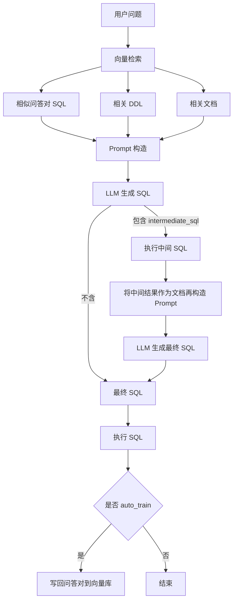

# Vanna 技术调研报告

本文基于仓库源码进行技术调研，聚焦 text-to-SQL 的 RAG 方案、训练机制、向量数据库集成与 LLM 的交互流程，并总结创新点与实践建议。

## 项目定位

- 面向业务数据查询的 text-to-SQL 系统，采用 RAG 策略，将“结构（DDL）+ 业务语义（文档）+ 示例（问答对）”检索为上下文，驱动 LLM 生成高质量 SQL。
- 通过多重继承解耦 LLM 提交与向量检索，实现“任意 LLM + 任意向量库”的自由组合。
- 支持本地/远程两种形态：本地模式使用本地向量库 + 外部 LLM API；远程模式将嵌入/检索与 LLM 提交托管到服务端。

## 核心架构

- 基类调度: `VannaBase` 负责统一工作流（RAG 检索、Prompt 构造、提交 LLM、中间 SQL 闭环、结果执行、可视化、训练与训练计划）
  - `src/vanna/base/base.py:72`
- LLM 适配: 以消息体接口和 `submit_prompt` 适配不同供应商（OpenAI、Anthropic、Mistral、DeepSeek、Ollama、vLLM、HF 等）
  - OpenAI 实现：`src/vanna/openai/openai_chat.py:53`
- 向量库适配: 统一三类集合（SQL/DDL/文档）的增删查改（Chroma、Qdrant、FAISS、PGVector、Milvus、Weaviate、Pinecone 等）
  - Qdrant 实现：`src/vanna/qdrant/qdrant.py:89`、`src/vanna/qdrant/qdrant.py:235`
  - Chroma 实现：`src/vanna/chromadb/chromadb_vector.py:65`、`src/vanna/chromadb/chromadb_vector.py:235`
- 组合式实例: 通过多重继承拼装“LLM + 向量库”
  - 本地示例：`src/vanna/local.py:4`
  - 你的脚本组合：`investigate_vanna_training.py:34`
- 数据库执行: 多种 `connect_to_*` 设置 `run_sql`，统一执行 LLM 生成的 SQL
- 远程模式: `VannaDB_VectorStore`/`VannaDefault` 将嵌入检索与 LLM 提交托管到服务端（RPC/GraphQL）
  - `src/vanna/vannadb/vannadb_vector.py:41`、`src/vanna/remote.py:24`

## RAG 工作流（端到端）

- 检索阶段（三路并行）
  - 近似问答对（few-shot 示例）：`get_similar_question_sql`
  - 相关 DDL（结构语义）：`get_related_ddl`
  - 相关文档（业务语义）：`get_related_documentation`
  - 调度入口：`src/vanna/base/base.py:124`
- Prompt 构造（分段注入）
  - DDL → “Tables”：`src/vanna/base/base.py:520`
  - 文档 → “Additional Context”：`src/vanna/base/base.py:536`
  - 示例 → “Question-SQL Pairs”：`src/vanna/base/base.py:553`
  - 响应规则（仅基于上下文 / 支持 intermediate_sql / 方言约束等）：`src/vanna/base/base.py:596`
  - 主函数：`get_sql_prompt`，`src/vanna/base/base.py:569`
- 生成与闭环
  - 提交 LLM：首次生成 SQL；若包含 `intermediate_sql`，可运行中间 SQL 获取真实枚举值，再二次生成最终 SQL
  - 代码：`src/vanna/base/base.py:139`
- 执行与回写
  - `ask` 中自动执行 SQL、展示结果；可 `auto_train` 将成功问答对回写向量库，持续改进 few-shot
  - 代码片段起始：`src/vanna/base/base.py:1700`

## 训练机制（Training）

- 统一训练入口：`train(question=None, sql=None, ddl=None, documentation=None, plan=None)`
  - SQL 训练：若仅给 SQL，会先用 LLM 反推问题文本再入库（`generate_question`），`src/vanna/base/base.py:1796`
  - DDL/文档训练：直接入库
  - 训练计划：`TrainingPlan` 将“信息架构文档/历史查询样本”自动构造成训练项并批量导入
    - 通用计划：`get_training_plan_generic(df)`，`src/vanna/base/base.py:1871`
    - Snowflake 计划：`get_training_plan_snowflake(...)`（含历史查询），`src/vanna/base/base.py:1935`
- 三类集合
  - 问答对 SQL（few-shot 模式归纳）：`add_question_sql`/`get_similar_question_sql`
  - DDL（结构理解）：`add_ddl`/`get_related_ddl`
  - 文档（业务语义与口径）：`add_documentation`/`get_related_documentation`

## 组件映射与关键实现

- `VannaBase.generate_sql`：总体编排（检索→Prompt→LLM→中间 SQL→二次生成）
  - `src/vanna/base/base.py:93`
- Prompt 构造三段式：`get_sql_prompt`
  - `src/vanna/base/base.py:569`
- 中间 SQL 闭环：`intermediate_sql` 机制
  - `src/vanna/base/base.py:139`
- 训练入口：`train`
  - `src/vanna/base/base.py:1796`
- 训练计划（信息架构/历史查询）
  - `src/vanna/base/base.py:1871`、`src/vanna/base/base.py:1935`
- Qdrant 写入与检索
  - 写入：`src/vanna/qdrant/qdrant.py:89`
  - 检索：`src/vanna/qdrant/qdrant.py:235`
- Chroma 写入与检索
  - 写入：`src/vanna/chromadb/chromadb_vector.py:65`
  - 检索：`src/vanna/chromadb/chromadb_vector.py:235`
- OpenAI 提交：`submit_prompt`
  - `src/vanna/openai/openai_chat.py:53`
- 组合式类（示例）：
  - 本地：`src/vanna/local.py:4`
  - 你的调研脚本：`investigate_vanna_training.py:34`

## Mermaid 流程图

## 向量库实现对比（要点）

- Qdrant（默认 fastembed）
  - 写入：`upsert(PointStruct{id, vector, payload})`，ID 通过 `deterministic_uuid` 生成（带 `-sql/-ddl/-doc` 后缀）
  - 检索：`query_points(..., with_payload=True)` 返回 payload（question/sql 或 ddl/doc）
  - 实现：`src/vanna/qdrant/qdrant.py:89`、`src/vanna/qdrant/qdrant.py:235`
- ChromaDB
  - 写入：`collection.add(documents, embeddings, ids)`
  - 检索：`collection.query(query_texts=[...], n_results=...)`
  - 实现：`src/vanna/chromadb/chromadb_vector.py:65`、`src/vanna/chromadb/chromadb_vector.py:235`
- FAISS（本地索引）
  - 依赖 `sentence-transformers` 生成嵌入；索引本地持久化；元数据 JSON 持久化
  - 实现：`src/vanna/faiss/faiss.py:1`
- PGVector（Postgres）
  - 使用 LangChain PGVector 向量存储；集合 `sql/ddl/documentation` 分离；SQL 训练项用 `Document.page_content` 存储 JSON
  - 实现：`src/vanna/pgvector/pgvector.py:1`

## LLM 交互与安全护栏

- 三段式上下文 + 响应规范（仅基于上下文、方言约束、中间 SQL 说明）
- SQL 运行白名单：`is_sql_valid` 默认仅允许 `SELECT`（可按需扩展）
  - `src/vanna/base/base.py:236`
- 中间 SQL 的“查枚举/查字典”闭环，降低“胡猜具体值”的失误率

## 创新点与优势

- 三集合检索融合（DDL/文档/示例）：同时解决“结构理解 + 业务口径 + 模式归纳”，比仅文档 RAG 更贴近 text-to-SQL 落地。
- 中间 SQL 校准：先查枚举/字典值再产出最终 SQL，显著降低错列/错值。
- 训练计划自动化：基于信息架构与历史查询自动生成训练项，降低冷启动成本。
- 插拔式后端架构：多重继承组合任意“LLM + 向量库”，工程集成友好。
- 持续学习：`ask(auto_train=True)` 将成功问答回写向量库，迭代提升召回质量。

## 使用示例与脚本

- 组合类与连接示例（Qdrant + OpenAI）：`investigate_vanna_training.py:34`
- 训练数据示例
  - DDL 训练：`investigate_vanna_training.py:114`
  - 文档训练：`investigate_vanna_training.py:140`
  - 问答对训练：`investigate_vanna_training.py:173`
- 训练数据管理（查看/删除）：`investigate_vanna_training.py:60`、`investigate_vanna_training.py:220`
- 完整问答流程演示：`demo_trained_vanna_usage.py:1`

注意：示例脚本中包含明文 API Key/数据库凭据，建议改为环境变量读取并在代码中校验，避免泄露。

## 最佳实践

- 先训练 DDL（表结构/字段维度）→ 再补充业务文档（口径、规则）→ 最后添加多样化问答对（聚合/过滤/Join/排序/窗口函数等）。
- 使用中间 SQL 机制解决“具体字符串/枚举值不确定”的问题（允许 LLM 先查 distinct）。
- 迭代训练：上线后开启 `auto_train`，并配合审核工作台定期清洗不佳的示例。
- Prompt 预算控制：通过 `str_to_approx_token_count` 与分段追加策略控制上下文长度，优先保留高相关内容。
- 安全运行：`is_sql_valid` 白名单策略（仅 SELECT），对生产库写操作保持禁用或人工审核。

## 风险与限制

- 上下文冲突/冗余：多集合融合可能引入重复或冲突信息，建议增加轻量重排/去重。
- 口径漂移：业务文档与历史 SQL 不一致会导致歧义，需定期对齐并清理过期项。
- 向量召回召回率：纯语义嵌入对列名/表名等短字符串的识别可能不稳定，建议引入结构化实体检索补强。

## 改进建议

- 融合重排：对 SQL/DDL/文档的召回结果进行重排与去重（BM25 + 向量融合）。
- 结构化检索：对表/列进行专门实体嵌入与短文本检索，提高列/表定位准确率。
- 训练审核台：为 `auto_train` 提供人工审核与撤销机制，保障 few-shot 质量。
- 观测与评估：内置评估集与统计（命中率、可执行率、正确率、修正次数），定期回归。

## 附：关键文件与行号参考

- `src/vanna/base/base.py:93` 生成 SQL 的主编排
- `src/vanna/base/base.py:569` Prompt 三段式构造
- `src/vanna/base/base.py:139` 中间 SQL 闭环
- `src/vanna/base/base.py:1796` 统一训练入口
- `src/vanna/base/base.py:1871` 通用训练计划（信息架构→文档）
- `src/vanna/base/base.py:1935` Snowflake 训练计划（含历史查询）
- `src/vanna/openai/openai_chat.py:53` OpenAI 提交实现
- `src/vanna/qdrant/qdrant.py:89`/`src/vanna/qdrant/qdrant.py:235` Qdrant 写入/检索
- `src/vanna/chromadb/chromadb_vector.py:65`/`src/vanna/chromadb/chromadb_vector.py:235` Chroma 写入/检索
- `src/vanna/local.py:4` 本地组合类示例
- `investigate_vanna_training.py:34` 你的组合类与连接示例

---

如需，我可以补充一张组件级架构图（Mermaid）或提供一个最小可复现实例（基于你当前的 Qdrant + OpenAI 组合，改为环境变量加载）以便直接跑通训练与问答流程。

